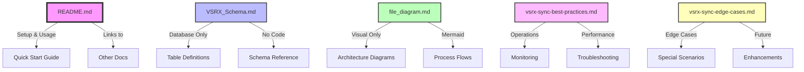

# VSRX Integration Documentation Index

This index provides a guide to all documentation files in the VSRX integration folder.

## 📚 Documentation Files

### 1. **README.md**
**Purpose**: Main entry point for VSRX implementation team  
**Contents**:
- Quick start guide
- System components division (VSRX vs SilknoteDocAnalysis)
- Division of responsibilities between teams
- Azure setup requirements and permissions guide
- Environment setup and configuration
- Installation and usage instructions
- Architecture overview and sync process flow
- Troubleshooting guide

**Use when**: You need to get started quickly or understand the overall system architecture

---

### 2. **VSRX_Schema.md**
**Purpose**: Complete database schema reference  
**Contents**:
- All VSRX table structures (read-only for sync)
- All SilknoteDocAnalysis table structures (read/write for sync)
- Field descriptions and relationships
- Example queries for common operations

**Use when**: You need to understand database structure or write queries

---

### 3. **file_diagram.md**
**Purpose**: Visual diagrams of data flow and relationships  
**Contents**:
- Entity relationship diagrams showing table connections
- Sync process flow diagram
- Webcomponent integration architecture
- Step-by-step data flow examples

**Use when**: You need to visualize how components interact

---

## Documentation Structure

This directory contains comprehensive documentation for the VSRX-SilknoteDocAnalysis integration. Each document has a specific focus to avoid redundancy:

## Document Purposes

### 📘 [README.md](./README.md)
**Purpose**: Quick start guide and setup instructions
- Environment configuration
- Installation steps
- Basic usage examples
- Feature overview
- Supported file types (.pdf, .doc, .docx, .rtf, .msg)
- API requirements
- Links to other documentation

### 📊 [VSRX_Schema.md](./VSRX_Schema.md) 
**Purpose**: Database schema reference only
- Table definitions for VSRX tables
- Table definitions for SilknoteDocAnalysis tables
- Key relationships
- Field descriptions
- No implementation details

### 📐 [file_diagram.md](./file_diagram.md)
**Purpose**: Visual architecture and flow diagrams
- Entity relationship diagrams
- Sync process flow charts
- System integration diagrams
- No textual explanations (diagrams only)

### 🔧 [vsrx-sync-best-practices.md](./vsrx-sync-best-practices.md)
**Purpose**: Operational guidance for running the sync
- Scheduling recommendations
- Performance optimization tips
- Monitoring strategies
- Troubleshooting procedures
- Maintenance tasks
- Security best practices

### 🎯 [vsrx-sync-edge-cases.md](./vsrx-sync-edge-cases.md)
**Purpose**: Edge case handling and future considerations
- File grouping decisions
- Concurrent access handling
- Error recovery strategies
- Patient re-booking scenarios
- Future enhancement roadmap

## Implementation Files

### 💻 [vsrx-sync.ts](./vsrx-sync.ts)
**Purpose**: Main synchronization implementation
- TypeScript source code
- Connects to MySQL database
- Reads files from VSRX filesystem
- Sends files to VitalSign API
- Filters to only supported document formats
- Handles document conversion

### 📦 [package.json](./package.json)
**Purpose**: Node.js dependencies
- Required npm packages
- Version specifications
- Script definitions

### 🔐 [env.example](./env.example)
**Purpose**: Environment variable template
- Configuration template
- Required environment variables
- Example values

## Test Files (TestXLSX Directory)

### 🧪 [TestXLSX/xlsx-handling-strategy.md](./TestXLSX/xlsx-handling-strategy.md)
**Purpose**: Research on Excel file handling (not implemented)
- Analysis of Excel conversion challenges
- Proposed solutions (not used in production)
- Kept for reference only

### 🧪 Test Implementation Files
- Various test scripts for Excel conversion experiments
- Not used in production sync process

## Key Points

1. **No Redundancy**: Each document has a specific purpose
2. **Clear Hierarchy**: README links to specialized docs
3. **Visual First**: Diagrams separated from text explanations
4. **Operational Focus**: Best practices focus on running the system
5. **Limited File Support**: Only document formats (.pdf, .doc, .docx, .rtf, .msg)
6. **No Image Support**: Image files (.png, .jpg, .bmp) are excluded
7. **No Excel Support**: .xlsx files excluded from sync process 