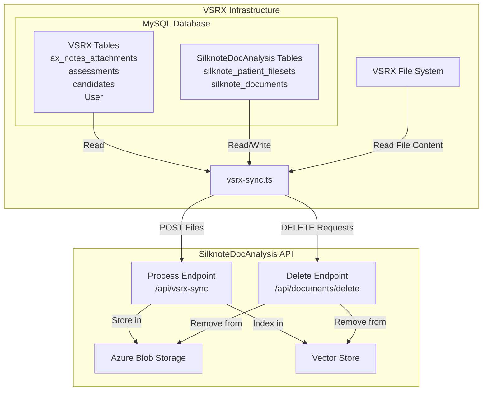
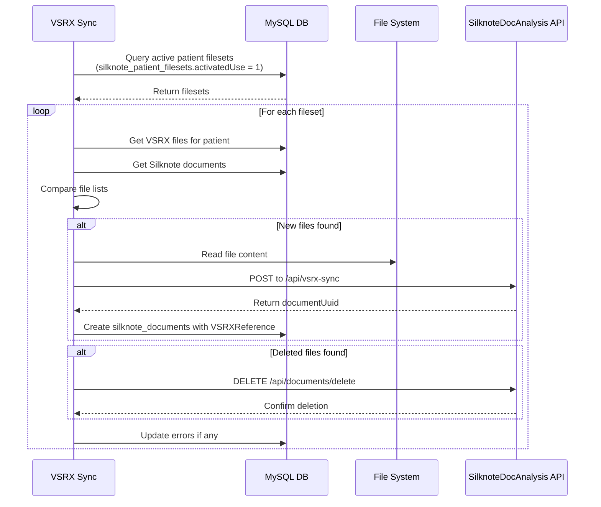

# VSRX File Sync Integration

This folder contains the isolated VSRX sync functionality that runs on VSRX infrastructure to synchronize files with the Silknote/VitalSign system.

## Documentation Overview

- **README.md** (this file) - Quick start guide, setup instructions, and usage examples
- **[VSRX_Schema.md](./VSRX_Schema.md)** - Complete database schema for VSRX and SilknoteDocAnalysis tables
- **[file_diagram.md](./file_diagram.md)** - Visual diagrams of architecture, data flow, and sync process
- **[vsrx-sync-best-practices.md](./vsrx-sync-best-practices.md)** - Best practices for sync implementation and monitoring
- **[vsrx-sync-edge-cases.md](./vsrx-sync-edge-cases.md)** - Detailed edge case handling and implementation decisions


## Overview

The sync process runs on VSRX servers and:
- Connects to the VSRX MySQL database (which contains both VSRX tables and SilknoteDocAnalysis tables)
- Reads files from the VSRX file system
- Sends new files to SilknoteDocAnalysis API for processing and storage in Azure
- Removes deleted files from Azure/Vector storage via SilknoteDocAnalysis API
- Only modifies SilknoteDocAnalysis tables (`silknote_patient_filesets`, `silknote_documents`) - never touches VSRX core tables

## System Components Division

### VSRX Components
- **MySQL Database**: VSRX's existing database with additional Silknote Document Analysis tables inserted
- **jQuery Frontend**: VSRX's existing jQuery application that will embed the Silknote Document Analysis webcomponent

### Silknote Doc Analysis Components
- **Webcomponent**: UI component code provided by Silknote, implemented in VSRX by VSRX team
- **SilknoteDocAnalysis Server**: Hosted on Azure App Services (can be set up with proper Azure permissions)
- **Azure Blob Storage**: 
  - Testing/Staging/Demo: Can be provided by Silknote
  - Production: Needs to be created by VSRX (sounds like EJ has already done this)

### Azure Setup Requirements
To set up the SilknoteDocAnalysis infrastructure, you'll need to grant global admin access to `joe@silknote.com.au` on your Azure subscription:

1. **Navigate to Azure Portal** (portal.azure.com)
2. **Go to Subscriptions** → Select your subscription
3. **Access Control (IAM)** → Click "+ Add" → "Add role assignment"
4. **Role**: Select "Owner" (for full management capabilities)
5. **Members**: Search for and select `joe@silknote.com.au`
6. **Review + Assign**: Complete the assignment

This will allow full management of all resources needed for the SilknoteDocAnalysis setup.

## Division of Responsibilities

### VSRX Responsibilities
- **Sync Implementation**: Review, test, and run the sync process (vsrx-sync.ts)
- **File System Access**: All reading from local file storage
- **Web Integration**: jQuery page embedding the SilknoteDocAnalysis webcomponent with props:
  - `silknotePatientUuid`
  - `silknoteUserUuid` 
  - `activationCost: 25`
  - `companyName: "VitalSignRx"`
- **Infrastructure**: Host Azure Blob Storage and App Service

### SilknoteDocAnalysis Server Responsibilities  
- **Process Endpoint**: Receive files, store in Azure Blob/Vector Store
- **Delete Endpoint**: Remove files from Azure storage
- **Database Updates**: Update `silknote_*` tables only
- **Webcomponent**: Provide the UI component for VSRX to embed

## Architecture



## Sync Process Flow



## Environment Variables

Create a `.env` file with the following configuration:

```bash
# MySQL Connection (VSRX Database)
MYSQL_HOST=localhost
MYSQL_USER=your_mysql_user
MYSQL_PASSWORD=your_mysql_password
MYSQL_DATABASE=vsrx_database
MYSQL_PORT=3306

# File System
VSRX_FILE_BASE_PATH=/home/1226418.cloudwaysapps.com/qpsjtdagpd/public_html/login/
# Note: 'notes/' prefix is stored in database, not included in base path

# SilknoteDocAnalysis Server
# The base URL of the SilknoteDocAnalysis server (no trailing slash)
SilknoteDocAnalysis_SERVER_PATH=https://silknotedocanalyse.azurewebsites.net

# Sync Configuration
SYNC_BATCH_SIZE=50              # Files per batch
SYNC_DRY_RUN=false             # Set to true for testing
SYNC_LOG_LEVEL=info            # error, warn, info, debug
```

## Installation

1. Install dependencies:
```bash
npm install mysql2 node-fetch form-data libreoffice-convert mammoth html-pdf @kenjiuno/msgreader
npm install --save-dev @types/node @types/node-fetch typescript
```

2. Compile TypeScript:
```bash
npx tsc vsrx-sync.ts --target es2020 --module commonjs
```

## Usage

### Manual Run
```bash
node vsrx-sync.js
```

### Scheduled Run (Cron)
Add to crontab for automatic sync every 10 minutes:
```bash
*/10 * * * * cd /path/to/VSRX-integration && /usr/bin/node vsrx-sync.js >> sync.log 2>&1
```

### Programmatic Usage
```typescript
import { VSRXSync, Config } from './vsrx-sync';

const config: Config = {
  MYSQL_HOST: 'localhost',
  MYSQL_USER: 'user',
  // ... other config
};

const sync = new VSRXSync(config);
await sync.connect();
const results = await sync.sync();
await sync.disconnect();
```

## Database Tables (All in VSRX MySQL)

### Read-Only Tables (Original VSRX Tables)
- `candidates` - Patient records (enhanced with `silknotePatientUuid` field)
- `assessments` - Assessment records
- `ax_notes_attachments` - File metadata (enhanced with `file_uuid` field)
- `User` - User records (enhanced with `silknoteUserUuid` field)

### Read/Write Tables (SilknoteDocAnalysis Tables)
- `silknote_patient_filesets` - Patient file collections
- `silknote_documents` - Document records with Azure storage references

## Security Considerations

1. **Path Validation**: All file paths are validated to prevent directory traversal
2. **Database Isolation**: Only Silknote tables are modified
3. **Local Deployment**: Runs on VSRX infrastructure without external authentication
4. **Error Logging**: Sensitive data is not logged

## Error Handling

Errors are logged to the patient fileset in the following structure:
```json
{
  "syncErrors": [{
    "timestamp": "2024-01-20T10:30:00Z",
    "operation": "add|delete",
    "fileId": "file-id",
    "fileName": "document.pdf",
    "error": "Error message",
    "retryCount": 0,
    "resolved": false
  }],
  "lastSyncAttempt": "2024-01-20T10:30:00Z",
  "lastSuccessfulSync": "2024-01-20T10:25:00Z",
  "consecutiveFailures": 0
}
```

## Monitoring

### Log Output
```
[INFO] 2024-01-20T10:30:00Z - Connected to MySQL database
[INFO] 2024-01-20T10:30:01Z - Found 5 active patient filesets
[INFO] 2024-01-20T10:30:02Z - Adding 3 files for patient uuid-123
[INFO] 2024-01-20T10:30:05Z - Sync completed
```

### Exit Codes
- `0` - Success
- `1` - Error (configuration missing or sync failed)

## Troubleshooting

### Common Issues

1. **"Missing required configuration"**
   - Check all environment variables are set
   - Verify .env file is in the correct location

2. **"Failed to connect to MySQL"**
   - Verify MySQL credentials
   - Check network connectivity
   - Ensure MySQL user has necessary permissions

3. **"Invalid file path"**
   - Check VSRX_FILE_BASE_PATH is correct
   - Verify file exists on disk
   - Check file permissions

4. **"Process endpoint returned 404"**
   - Verify SilknoteDocAnalysis_SERVER_PATH is correct
   - Check API endpoint URL is accessible
   - Ensure the server is running

### Debug Mode
Enable debug logging for detailed information:
```bash
SYNC_LOG_LEVEL=debug node vsrx-sync.js
```

## Performance Considerations

- Processes files in batches (default: 50)
- Implements connection pooling for MySQL
- Validates files before reading to avoid memory issues
- Logs are rotated at 1000 entries per patient

## Future Enhancements

1. **Real-time Sync**: Webhook support for immediate sync
2. **Retry Logic**: Exponential backoff for failed operations
3. **Metrics**: Prometheus/Grafana integration
4. **Compression**: Gzip support for large files 

## Features

- **Automatic Document Conversion**: Converts `.doc`, `.docx`, `.rtf`, and `.msg` files to PDF before sending to SilknoteDocAnalysis API
- **Required Headers**: Includes `x-silknote-user-uuid` and `x-silknote-patient-uuid` headers as required by the API
- **Path Validation**: Prevents directory traversal attacks
- **Error Logging**: Comprehensive error tracking in patient filesets
- **Batch Processing**: Configurable batch sizes for large datasets
- **Dry Run Mode**: Test sync without making changes

## Supported File Types

The sync process only handles document files:

- **Supported Formats**: `.pdf`, `.doc`, `.docx`, `.rtf`, `.msg`
- **Not Supported**: Image files (`.png`, `.jpg`, `.jpeg`, `.bmp`) and Excel files (`.xlsx`)

## Document Conversion

The sync process automatically converts non-PDF documents to PDF format before uploading:

- **Conversion Methods**:
  - `.msg`: Uses @kenjiuno/msgreader to extract email content and converts to formatted PDF
  - `.docx`: Uses Mammoth.js first (better for simple documents), falls back to LibreOffice
  - `.doc`, `.rtf`: Uses LibreOffice conversion
- **MSG File Handling**: Email messages are converted with headers (From, To, Subject, Date), body text, and attachment list preserved
- **Original Format Tracking**: Stores the original file format in metadata

### LibreOffice Requirement

For document conversion to work, LibreOffice must be installed on the server:

```bash
# Ubuntu/Debian
sudo apt-get update
sudo apt-get install libreoffice

# CentOS/RHEL
sudo yum install libreoffice
```

## API Headers

The sync process includes all required headers for SilknoteDocAnalysis API:

- `x-silknote-user-uuid` - User identifier from patient fileset
- `x-silknote-patient-uuid` - Patient identifier
- `Content-Type` - Automatically set for multipart/form-data
- No API key required (runs locally on VSRX infrastructure) 