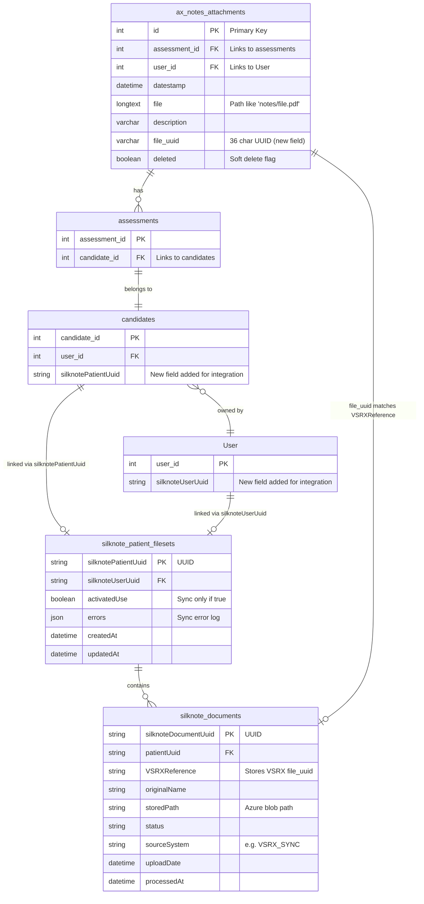
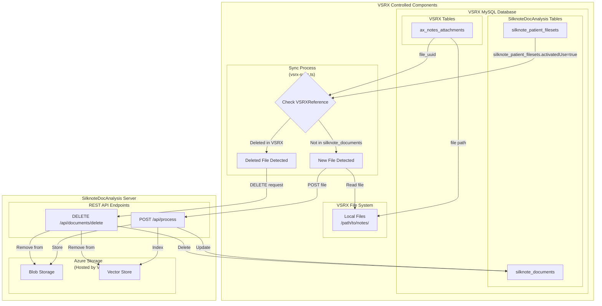
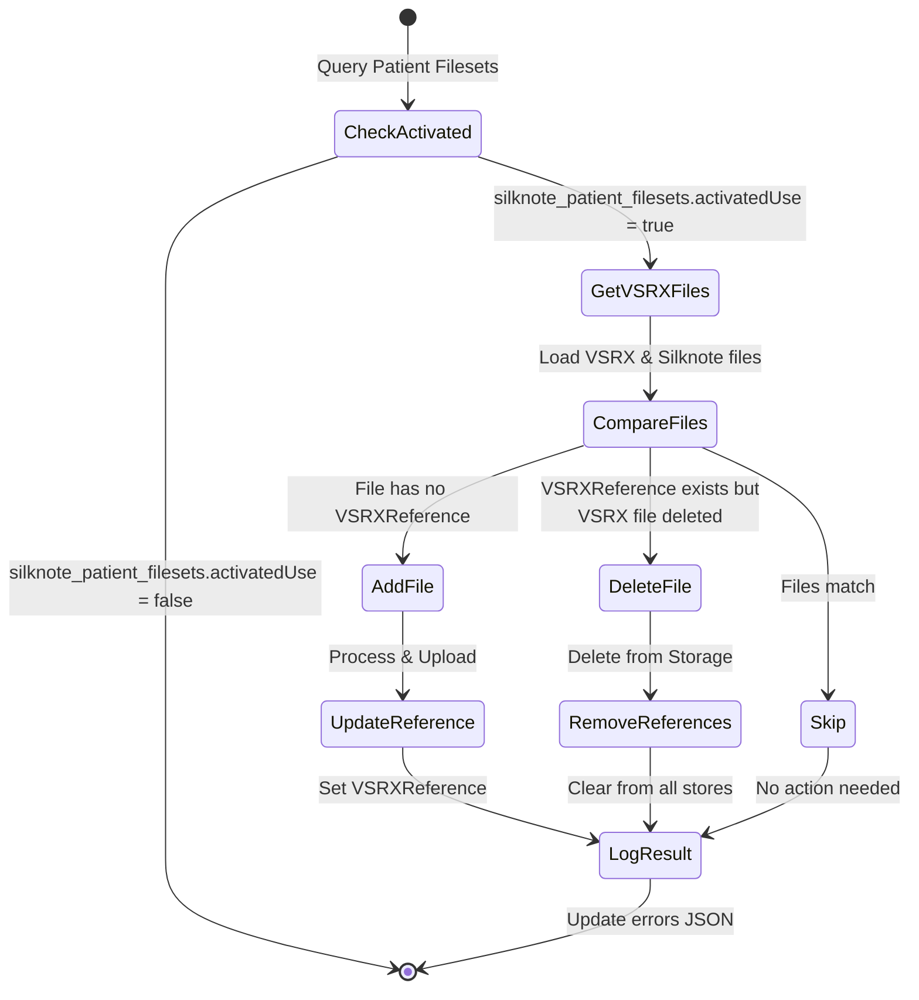
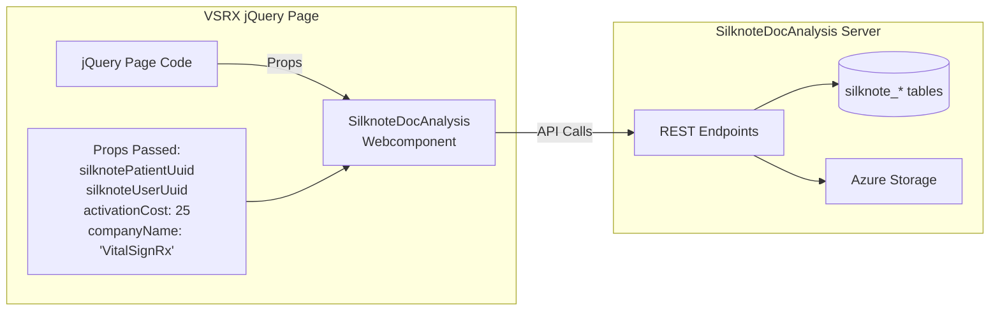

# File Relationships Between VSRX and SilknoteDocAnalysis

## Overview

This diagram illustrates how files are tracked and related within the VSRX MySQL database, where both VSRX tables and SilknoteDocAnalysis tables coexist.

> **Note**: For division of responsibilities between VSRX and SilknoteDocAnalysis, see the [Division of Responsibilities](./README.md#division-of-responsibilities) section in the README.

## Entity Relationship Diagram

## Sync Process Flow

## Key Relationships (All within VSRX MySQL Database)

### 1. Patient Linking
- `candidates.silknotePatientUuid` → `silknote_patient_filesets.silknotePatientUuid`
- Only patients with `silknote_patient_filesets.activatedUse = true` are synced

### 2. User Linking
- `User.silknoteUserUuid` → `silknote_patient_filesets.silknoteUserUuid`

### 3. File Reference
- `ax_notes_attachments.file_uuid` → `silknote_documents.VSRXReference`
- This is the primary key for tracking which files have been processed

### 4. File Storage
- **Original Files**: Stored on VSRX filesystem at path specified in `ax_notes_attachments.file`
- **Processed Files**: Uploaded to Azure Blob Storage via SilknoteDocAnalysis API, path stored in `silknote_documents.storedPath`

## Sync Logic

## Webcomponent Integration

## Data Flow Example

### Adding a New File:
1. **VSRX**: User uploads file → creates record in `ax_notes_attachments`
2. **VSRX Sync**: Detects file with `file_uuid` not in any `silknote_documents.VSRXReference`
3. **VSRX Sync**: Reads file from VSRX filesystem
4. **VSRX Sync**: POSTs file to SilknoteDocAnalysis `/api/process` endpoint
5. **SilknoteDocAnalysis**: Stores file in Azure Blob Storage
6. **SilknoteDocAnalysis**: Indexes in Vector Store
7. **SilknoteDocAnalysis**: Creates `silknote_documents` record with `VSRXReference = file_uuid`

### Deleting a File:
1. **VSRX**: Marks `ax_notes_attachments.deleted = true`
2. **VSRX Sync**: Finds `silknote_documents` with matching `VSRXReference`
3. **VSRX Sync**: Sends DELETE request to `/api/documents/delete`
4. **SilknoteDocAnalysis**: Removes from Azure Blob Storage
5. **SilknoteDocAnalysis**: Removes from Vector Store
6. **SilknoteDocAnalysis**: Deletes `silknote_documents` record 