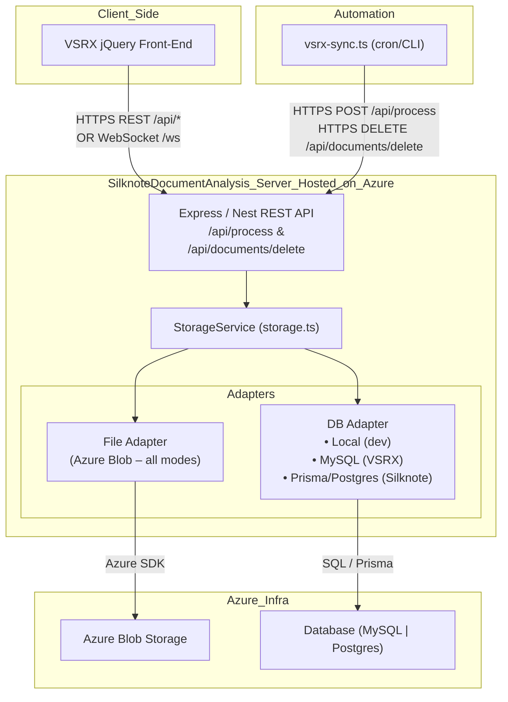
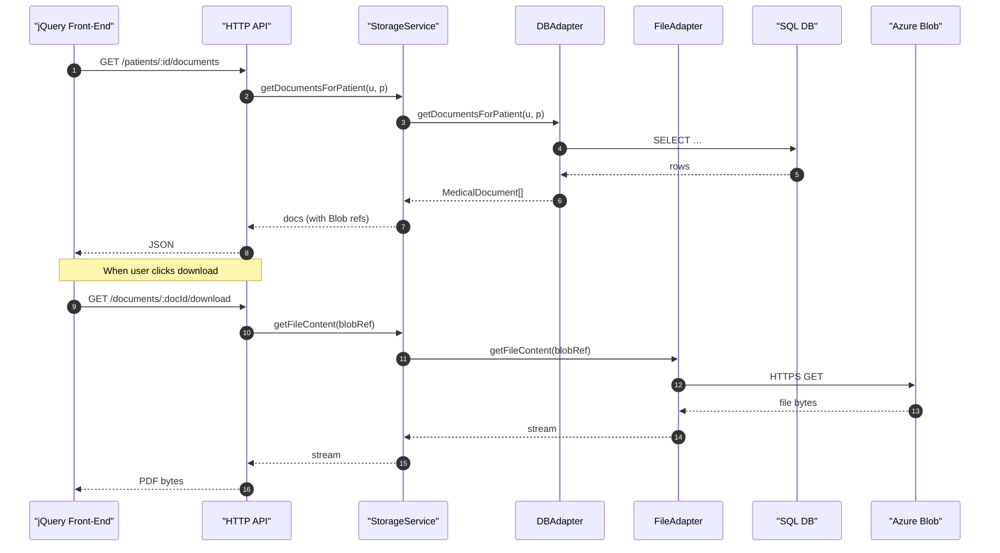
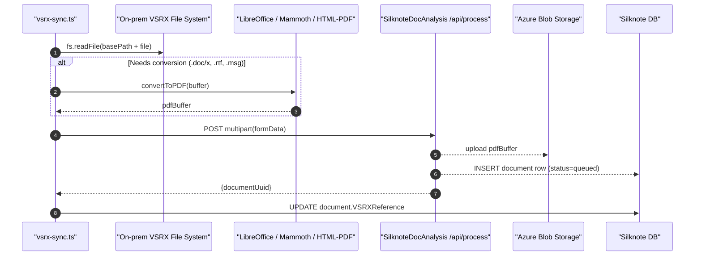

# Beam Server – Storage & Request Flow

## 1. Runtime paths (all modes)



Key points:
* **Azure Blob is the *only* file store** for both VSRX and Silknote runtime modes; Local FS writes are disabled in production.
* The **`StorageService`** selects its adapters at start-up based on `OPERATING_MODE` but _always_ returns Blob URLs or streams.

---

## 2. Detailed request: list & fetch patient documents



---

## 3. Off-line VSRX → Silknote sync (`vsrx-sync.ts`)

`VSRX-integration/vsrx-sync.ts` runs **inside the VSRX environment** (cron / CLI) and bridges on-prem files into the cloud system:



Highlights:
* **Local path validation**: `isPathSafe()` ensures every `fullPath` stays within `VSRX_FILE_BASE_PATH`.
* **Reads only** – There is _no_ write-back to the VSRX filesystem. Once uploaded, the PDF lives in Azure Blob.
* **Conversion pipeline**:
  * `.doc/.docx/.rtf` → LibreOffice or Mammoth → PDF.
  * `.msg` (Outlook email) → HTML template → html-pdf → PDF.
* **Deletion path**: If a file is removed on VSRX the script calls `DELETE /api/documents/delete`, which cascades to DB & Blob.

---

## 4. Security note – UUID brute-force

Patient identifiers are random UUID-v4 (≈ 122-bit). The server has **two separate rate limiters**:

### HTTP Request Rate Limiter
```typescript
// src/index.ts lines 128-130
const rateLimiter = new RateLimiterMemory({
  points: 10,    // Number of requests  
  duration: 1    // Per second
});
```

This limits **HTTP requests to 10 per second per IP address**. For brute-forcing patient UUIDs via API calls:

```
2^122 possible UUIDs / 10 requests·sec⁻¹ ≈ 1.3×10^35 seconds ≈ 4.2×10^27 years
```

### LLM Token Rate Limiter  
The **400,000 tokens/minute** limit in `centralRateLimiter.ts` applies only to **internal LLM API calls** (document analysis, case summaries, etc.), not HTTP endpoints used for UUID enumeration.

**Conclusion**: Even at the HTTP rate limit of 10 req/sec, brute-forcing a patient UUID would take over **4 billion trillion trillion years**—computationally impossible. 